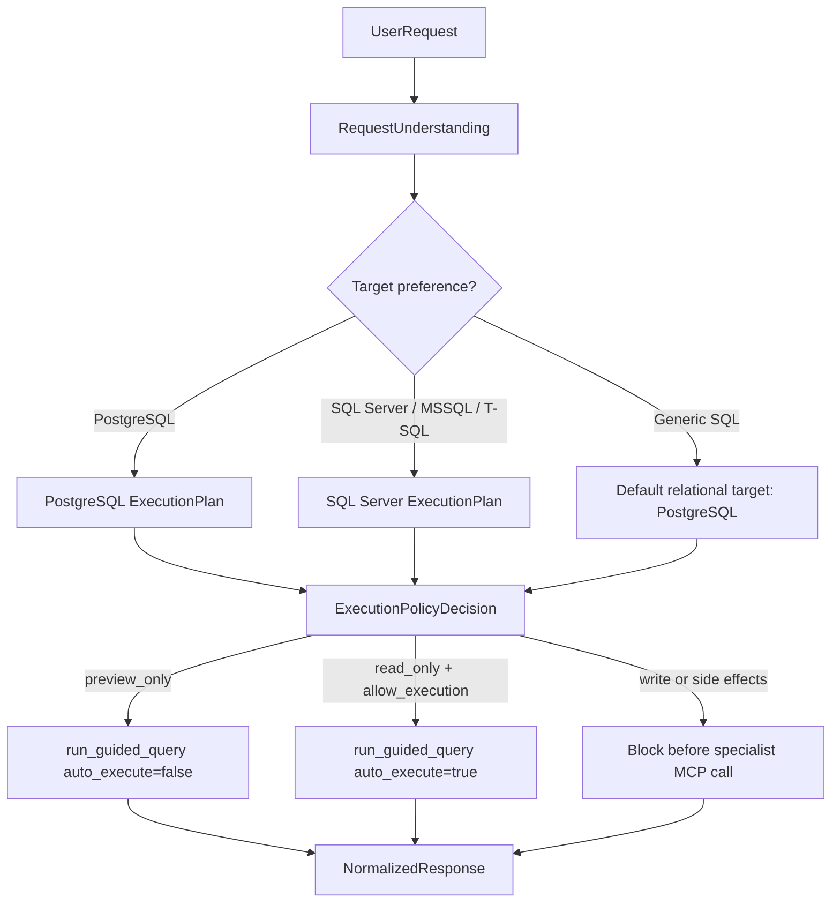
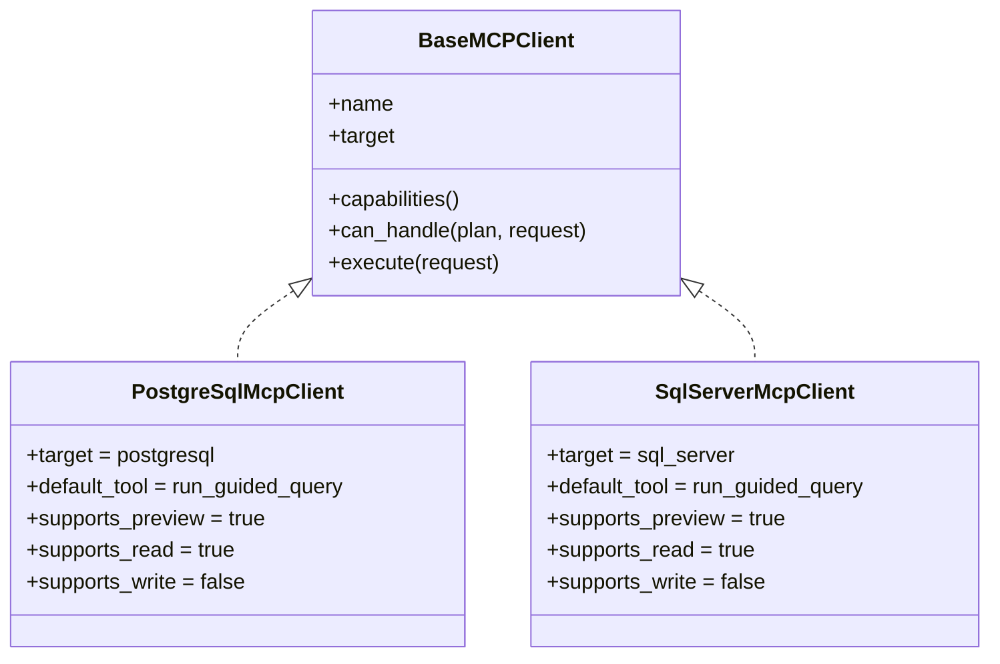

# Phase 2 - Multi-Backend Relational Orchestration

## Summary

Phase 2 adds SQL Server as the second real specialist MCP client adapter while preserving the contracts introduced in Phase 0 and Phase 1.

The orchestrator now proves that relational orchestration is not PostgreSQL-specific. PostgreSQL and SQL Server both use the same high-level flow:

```text
UserRequest
  -> RequestUnderstanding
  -> RetrievedContext
  -> EnrichedRequest
  -> ExecutionPolicyDecision
  -> ExecutionPlan
  -> SpecialistExecutionRequest
  -> SpecialistExecutionResult
  -> NormalizedResponse
```

Policy remains backend-agnostic. Routing chooses the backend. Specialist clients only execute the policy-approved specialist request.

## Relational Backend Flow



## Specialist Clients



Both relational clients use `StdioMcpToolRunner` and `LocalMcpServerCatalog`.

## Routing Rules

Routing remains isolated from client internals. It uses:

- `RequestUnderstanding.target_preference`
- `RequestUnderstanding.candidate_mcps`
- `ExecutionPolicyDecision`
- `McpClientCapability`

Current behavior:

- explicit PostgreSQL requests route to PostgreSQL
- explicit SQL Server, MSSQL, or T-SQL requests route to SQL Server
- generic SQL requests still default to PostgreSQL
- both relational backends are preview-first by default
- blocked write or side-effecting requests do not call any relational MCP

## Common Relational MCP Expectations

Relational MCP servers should expose equivalent intent, even if their internal implementation differs.

Minimum expected capabilities:

- schema discovery
- table listing
- table description
- safe query preview
- optional read-only execution when governance allows it
- blocked write and side-effecting operations by default

The default preview tool is:

```text
run_guided_query
```

Preview-first arguments:

```json
{
  "question": "...enriched request...",
  "auto_execute": false,
  "limit": 100
}
```

Read-only execution can be enabled only when policy allows it:

```json
{
  "metadata": {
    "allow_execution": true
  }
}
```

## SQL Server MCP Setup Assumptions

The SQL Server client adapter is implemented, but this repository does not currently include a SQL Server MCP server under `mcps/`.

The local catalog recognizes these folder aliases:

```text
mcps/sql-server-mcp/
mcps/sqlserver-mcp/
mcps/mssql-mcp/
```

Each folder should expose a `server.py` entrypoint for stdio MCP execution.

Until such a server is added, the SQL Server client returns a controlled error:

```text
MCP server not found: sql_server
```

## Traceability

The orchestration trace records the selected backend and policy decision:

```text
NormalizedResponse.debug.orchestration_trace
```

Backend-specific transport details remain inside the specialist result `debug` field.

## Test Coverage

Phase 2 adds tests for:

- SQL Server client capabilities
- SQL Server preview-first specialist requests
- SQL Server read-only opt-in
- SQL Server MCP error mapping
- missing SQL Server MCP server errors
- PostgreSQL vs SQL Server routing
- SQL Server catalog aliases
- PostgreSQL regression behavior

The full test suite passes without a real SQL Server MCP server installed because SQL Server client behavior is validated with fake catalog and runner implementations.
